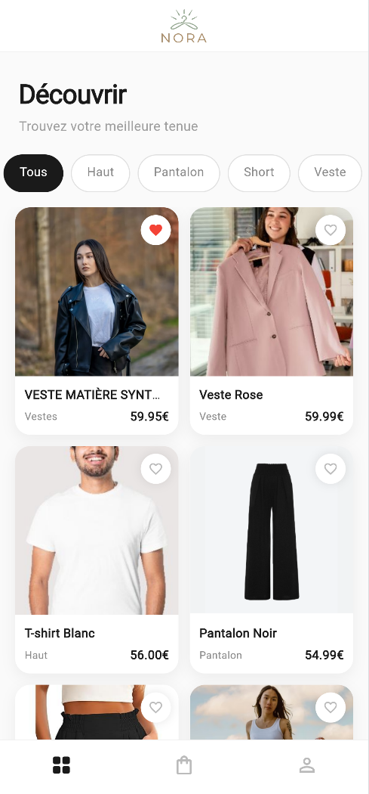
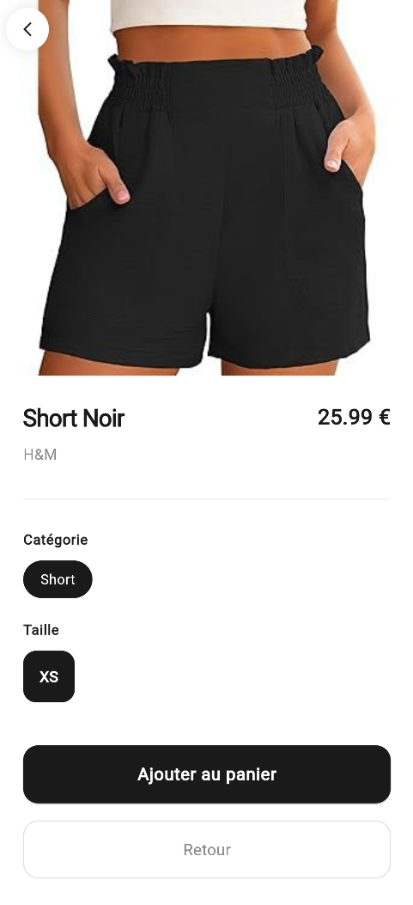
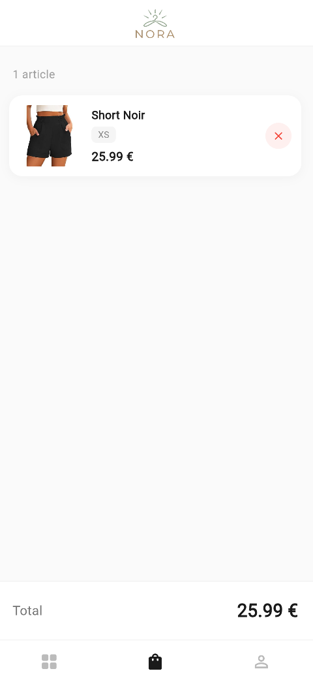
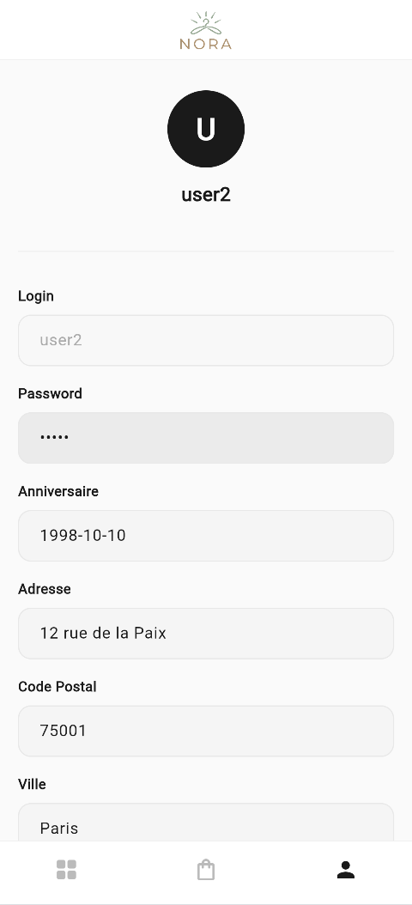
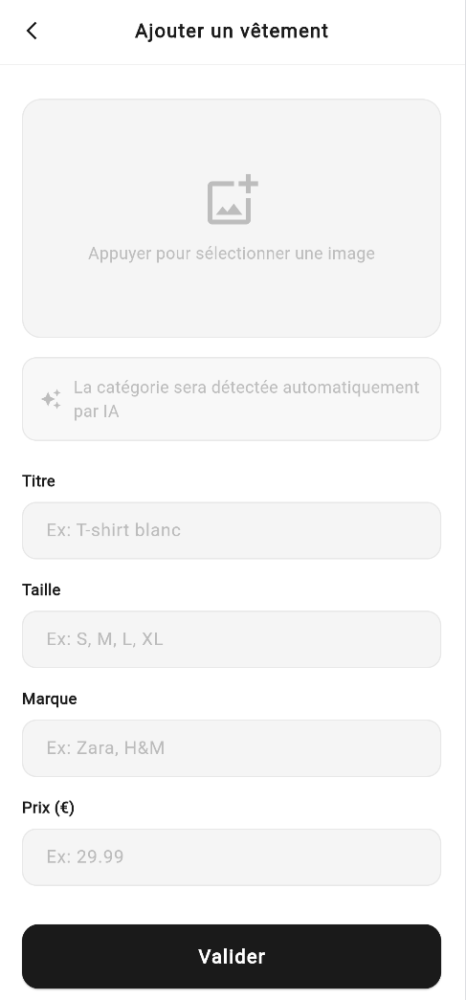
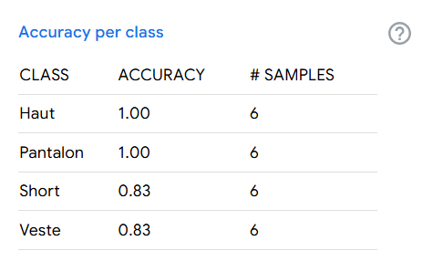
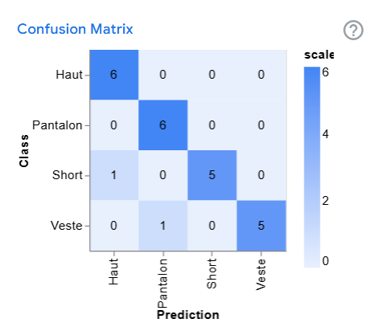

# NORA - Application Flutter de vente de vêtements

Projet réalisé dans le cadre du TP2 - MIAGE IA2  
Développement Mobile en Flutter

---

## Description

NORA est une application mobile de e-commerce de vêtements développée avec Flutter et Firebase.  
Elle permet aux utilisateurs de parcourir un catalogue de vêtements, de gérer leur panier,  
de modifier leur profil et d'ajouter de nouveaux vêtements grâce à une détection automatique  
de catégorie par Intelligence Artificielle (TFLite).

<div align="center">


</div>

---

## Fonctionnalités réalisées

### MVP

- [x] **US#1** - Interface de login avec vérification Firebase
- [x] **US#2** - Liste des vêtements récupérée depuis Firestore (vue en grille)
- [x] **US#3** - Détail d'un vêtement avec ajout au panier
- [x] **US#4** - Panier avec total et suppression d'articles
- [x] **US#5** - Profil utilisateur avec modification et déconnexion
- [x] **US#6** - Ajout d'un vêtement avec détection automatique de catégorie par IA (TFLite + TensorFlow.js)

---

## Intelligence Artificielle

Le modèle de détection de catégorie a été entraîné avec **Google Teachable Machine**  
sur des images de vêtements réparties en 4 catégories :

- 👖 Pantalon
- 🩳 Short
- 👕 Haut
- 🧥 Veste

Le modèle TFLite est chargé dans le navigateur via **TensorFlow.js**  
et prédit automatiquement la catégorie d'un vêtement à partir d'une photo.

Images utilisées pour l'entraînement : disponibles dans `assets/images/training_ia/`

---

## Aperçu de l'application

<div align="center">

| Login                                       | Découvrir                                   | Détail                                   |
| ------------------------------------------- | ------------------------------------------- | ---------------------------------------- |
|  |  |  |

| Panier                                   | Profil                                    | Ajouter (IA)                             |
| ---------------------------------------- | ----------------------------------------- | ---------------------------------------- |
|  |  |  |

</div>

---

## Utilisateurs de test

| Login | Password |
| ----- | -------- |
| user1 | user1    |
| user2 | user2    |

---

## Technologies utilisées

- **Flutter** (Web)
- **Firebase Firestore** - base de données
- **Firebase Storage** - stockage des images
- **TensorFlow Lite** - modèle IA de classification
- **Google Teachable Machine** - entraînement du modèle
- **Cached Network Image** - affichage optimisé des images

---

## Device utilisé

Ce projet a été développé et testé sur **Google Chrome** (Flutter Web).

⚠️ Lancer obligatoirement avec Chrome ou Edge :

```bash
flutter run -d chrome
```

---

## Images utilisées pour la classification IA

Le modèle a été entraîné sur **Google Teachable Machine** avec des photos  
de vêtements réparties en 4 catégories :

| Catégorie | Nombre d'images |
| --------- | --------------- |
| Pantalon  | 40 images       |
| Short     | 40 images       |
| Haut      | 40 images       |
| Veste     | 40 images       |

Les images d'entraînement sont disponibles dans `assets/images/training_ia/`

---

## Performance du modèle IA

### Accuracy par classe



### Confusion Matrix



---

## Lancer le projet

### Prérequis

- Flutter SDK installé
- Google Chrome ou Microsoft Edge
- Git

### Cloner le projet

```bash
git clone https://github.com/NourElBazzal/Flutter-ecommerce-nora.git
cd Flutter-ecommerce-nora
```

### Installer les dépendances

```bash
flutter pub get
```

---

## ⚠️ Important — Comment lancer le projet

Ce projet est optimisé pour une **vue mobile sur navigateur**.

### Lancer en mode mobile :

1. Lancer l'application :

```bash
flutter run -d chrome
```

2. Une fois Chrome ouvert :
   - Appuie sur **F12** pour ouvrir les DevTools
   - Clique sur l'icône **"Toggle device toolbar"** (ou **Ctrl + Shift + M**)
   - Choisis un device mobile comme **iPhone 12 Pro** ou **Galaxy S20**
   - Rafraîchis la page (**F5**)

L'application est conçue pour un écran de **390px de large** environ.

### ⚠️ Ne pas utiliser en plein écran desktop

Le design est optimisé pour mobile — en plein écran desktop les grids et cards peuvent sembler déformés.

---

## Structure du projet

```
projet_td2/
  lib/
    modeles/
      user.dart                  — Modèle utilisateur
      vetement.dart              — Modèle vêtement
      categorie_vetement.dart    — Enum catégories IA
    services/
      vetement_classifier.dart   — Service détection IA TFLite
    pages/
      login_page.dart            — Page de connexion
      home_page.dart             — Navigation principale
      clothes_list_page.dart     — Liste des vêtements
      clothes_detail_page.dart   — Détail d'un vêtement
      cart_page.dart             — Panier
      profile_page.dart          — Profil utilisateur
      ajout_vetement_page.dart   — Ajout vêtement avec IA
    firebase_options.dart        — Configuration Firebase
    main.dart                    — Point d'entrée
  assets/
    images/
      training_model_images/     — Images d'entraînement du modèle IA
        Haut/                    — Photos de hauts
        Pantalon/                — Photos de pantalons
        Short/                   — Photos de shorts
        Veste/                   — Photos de vestes
      model_unquant.tflite       — Modèle TFLite entraîné
      labels.txt                 — Labels du modèle (4 catégories)
      logo.png                   — Logo de l'application
  web/
    index.html                   — TensorFlow.js + TFLite bridge
  pubspec.yaml                   — Dépendances Flutter
  README.md                      — Documentation
```

---

## Auteur

**Nour EL BAZZAL**  
MIAGE IA2 - 2025/2026
